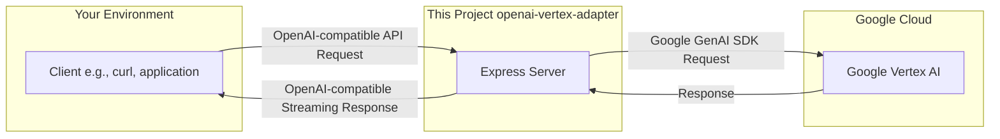

# OpenAI-Compatible API Adapter for Vertex AI

This project provides a lightweight, OpenAI-compatible API adapter for Google Cloud's Vertex AI. It allows you to use existing tools and applications that are designed for the OpenAI API with Google's powerful Gemini models, without needing to modify the client-side code.

The server translates incoming OpenAI-style API requests into the format required by the Google GenAI SDK and streams the responses back in the OpenAI-compatible format.

## Architecture

The adapter sits between your client application and Google's Vertex AI service, acting as a translation layer.



## Features

- **OpenAI Compatibility:** Exposes a `/v1/chat/completions` endpoint that mimics the OpenAI API.
- **Model Mapping:** Lists available Gemini models under the `/v1/models` endpoint.
- **Streaming Support:** Streams responses back to the client in real-time.
- **Request/Response Logging:** Logs all incoming requests, transformed payloads, and final responses to timestamped log files in the `log/` directory for easy debugging.
- **Simple Authentication:** Uses a simple bearer token authentication middleware.

## Prerequisites

- [Node.js](https://nodejs.org/) (v14 or higher recommended)
- [pnpm](https://pnpm.io/) (or npm/yarn)
- A Google Cloud project with the Vertex AI API enabled.

## Installation

1.  Clone the repository:

    ```sh
    git clone https://github.com/your-username/openai-vertex-adapter.git
    cd openai-vertex-adapter
    ```

2.  Install the dependencies:
    ```sh
    pnpm install
    ```

## Configuration

1.  Create a `.env` file in the root of the project by copying the example file:

    ```sh
    cp .env.example .env
    ```

2.  Edit the `.env` file and add your Google Cloud project details:

    ```
    GOOGLE_API_KEY=your-api-key
    GOOGLE_CLOUD_PROJECT=your-project-id
    GOOGLE_CLOUD_LOCATION=us-central1
    ```

    - `GOOGLE_API_KEY`: Your Google Cloud API key.
    - `GOOGLE_CLOUD_PROJECT`: Your Google Cloud project ID.
    - `GOOGLE_CLOUD_LOCATION`: The Google Cloud region where your Vertex AI models are available.

## Usage

1.  Start the server:

    ```sh
    pnpm start
    ```

    The server will be running at `http://localhost:3000`.

2.  You can now send requests to the server using any OpenAI-compatible client. Here is an example using `curl`:

    ```sh
    curl http://localhost:3000/v1/chat/completions \
      -H "Content-Type: application/json" \
      -H "Authorization: Bearer your-api-key" \
      -d '{
        "model": "gemini-1.5-pro",
        "messages": [
          {
            "role": "user",
            "content": "Write a short story about a robot who discovers music."
          }
        ],
        "stream": true
      }'
    ```

## Logging

The application automatically logs important events to files in the `log/` directory. A new log file is created each time the server starts. The logs include:

- Incoming requests (`request`)
- Transformed requests sent to Google (`transformed-request`)
- Full responses (`response`)
- Errors (`error`)

This makes it easy to trace the lifecycle of a request and debug any issues.
